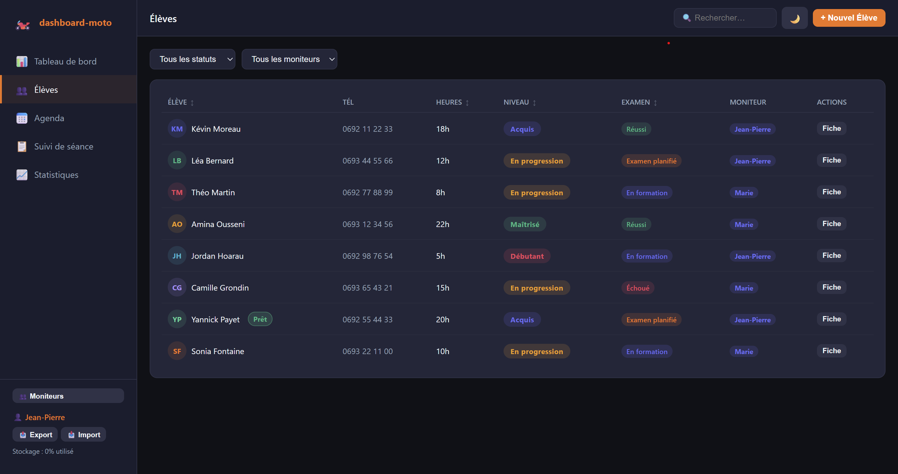
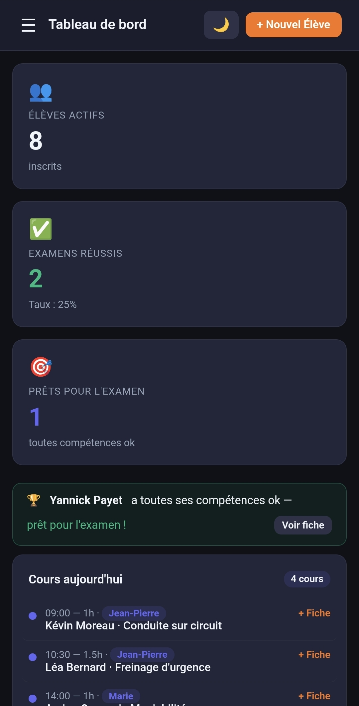

# 🏍️ Dashboard Moto-École

> Application web (PWA) de gestion complète pour moto-écoles : suivi des élèves, planning, paiements, pédagogie et statistiques. **100 % local, 100 % gratuit, 100 % hors-ligne.**

[](https://mystique-v.github.io/dashboard-moto/)
[](https://mystique-v.github.io/dashboard-moto/)
[](#-licence)

---

## 🎯 À propos

Dashboard conçu pour simplifier la gestion quotidienne d'une moto-école : suivi individuel des élèves, planning des séances, gestion financière et visualisation pédagogique — le tout sans base de données, sans abonnement, sans inscription.

**Philosophie** : tes données restent sur ton appareil. Aucun serveur, aucun compte, aucune collecte.

---

## 📸 Aperçu

### Version bureau


### Version mobile


---

## ✨ Fonctionnalités

### 👥 Gestion des élèves
- Fiche complète : coordonnées, permis (A1/A2/A), moniteur référent
- Suivi pédagogique par compétence (note + statut acquis/en progression)
- Statut d'examen (planifié / réussi / échoué / en formation)
- Filtres multiples : statut, permis, moniteur, solde (dette / à jour / crédit)
- Recherche instantanée (nom, prénom, téléphone, email)
- Vue cartes optimisée sur mobile

### 📅 Planning & séances
- Agenda hebdomadaire par moniteur
- Suivi heure par heure des séances réalisées
- Compteur automatique d'heures par élève

### 💶 Gestion financière
- Contrats et forfaits personnalisés
- Suivi des paiements (espèces, CB, chèque, virement)
- Alertes élèves en dette / en crédit
- **Export CSV** compatible Excel FR (mois en cours ou historique complet)

### 📊 Statistiques & visualisation
- Chiffre d'affaires sur 12 mois
- Répartition par type de permis
- Statuts d'examens (réussis / échoués / planifiés / en formation)
- Volume de séances mensuel
- Radar des compétences moyennes
- Courbe d'évolution individuelle par élève

### 🎨 UX
- Thème clair / sombre
- Responsive (bureau, tablette, mobile)
- Installable en PWA (écran d'accueil iOS/Android, bureau Windows/Mac)
- Fonctionne **hors-ligne** après la première visite

---

## 🚀 Démo en ligne

👉 **[https://mystique-v.github.io/dashboard-moto/](https://mystique-v.github.io/dashboard-moto/)**

L'app charge avec des données d'exemple (8 élèves, paiements, séances) pour que tu puisses tester immédiatement. Tu peux tout effacer depuis le bouton d'import/export dans la sidebar.

---

## 📱 Installation en PWA

### Sur Android (Chrome)
1. Ouvre la démo dans Chrome
2. Menu `⋮` → **Installer l'application**
3. L'icône apparaît sur ton écran d'accueil

### Sur iPhone (Safari)
1. Ouvre la démo dans Safari
2. Bouton Partager → **Sur l'écran d'accueil**

### Sur bureau (Chrome / Edge)
1. Icône `⊕` dans la barre d'adresse → **Installer**
2. L'app s'ouvre dans sa propre fenêtre

---

## 🛠️ Stack technique

| Brique | Choix |
|---|---|
| Langage | HTML + CSS + JavaScript (vanilla, sans framework) |
| Graphiques | [Chart.js 4.4](https://www.chartjs.org/) |
| Stockage | `localStorage` avec système de migration versionné |
| Hors-ligne | Service Worker (stratégie cache-first) |
| Hébergement | GitHub Pages |
| Build | Aucun — ouvre `index.html`, c'est tout |

**Zéro dépendance serveur**, zéro build tool, zéro framework. L'app entière tient dans un seul `index.html` + `sw.js` + `manifest.json`.

---

## 💾 Données & vie privée

- 🔒 **Toutes les données sont stockées dans le `localStorage` de ton navigateur.**
- ❌ Rien n'est envoyé sur un serveur (il n'y en a pas).
- 📥 **Export** : sauvegarde complète en fichier `.json` depuis la sidebar
- 📤 **Import** : restauration depuis un fichier `.json`
- 🔄 **Migration automatique** : les anciennes versions de données sont migrées au chargement

> ⚠️ **Important** : vider le cache du navigateur efface les données. Fais des exports réguliers.

---

## 🧑‍💻 Développement local

Aucun build, aucune installation nécessaire :

```bash
git clone https://github.com/mystique-v/dashboard-moto.git
cd dashboard-moto
# Ouvre index.html dans ton navigateur
# ou lance un serveur local :
python -m http.server 8000
```

Puis ouvre [http://localhost:8000](http://localhost:8000).

### Structure du projet

```
dashboard-moto/
├── index.html          # Application complète (HTML + CSS + JS)
├── sw.js               # Service Worker (cache hors-ligne)
├── manifest.json       # Manifeste PWA
├── icon-192.png        # Icône 192×192
├── icon-512.png        # Icône 512×512
└── screenshot-*.png    # Captures d'écran
```

### Mettre à jour le cache PWA

Quand tu modifies `index.html`, pense à incrémenter `CACHE_VERSION` dans `sw.js` — sinon les utilisateurs continueront de recevoir l'ancienne version depuis leur cache.

```js
const CACHE_VERSION = 'moto-ecole-v12'; // ← bumper ici
```

---

## 🗺️ Roadmap

- [ ] Forfaits prédéfinis (création rapide d'élève depuis un template)
- [ ] Fiche élève imprimable (PDF)
- [ ] Rappels locaux (examens à venir, paiements en retard)
- [ ] Multi-utilisateur (nécessiterait un backend)
- [ ] Authentification + rôles (admin / moniteur / secrétaire)
- [ ] Sync multi-appareil via Supabase
- [ ] Forfaits prédéfinis
- [ ] Fiche élève imprimable (PDF)

---

## 📜 Licence

MIT — libre d'utilisation, modification et distribution.

---

<p align="center">
  Fait avec ❤️ à La Réunion 🌴
</p>
